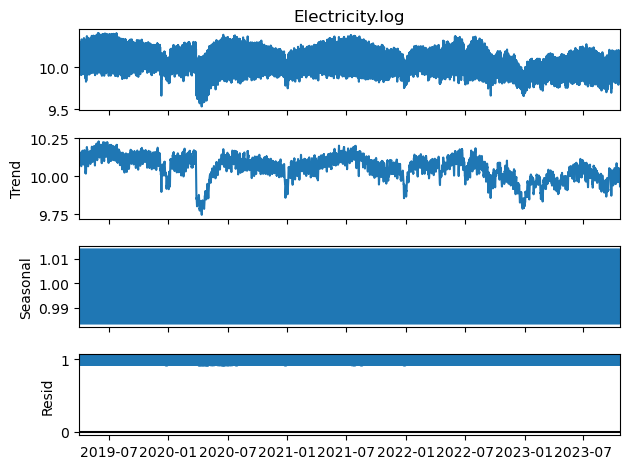
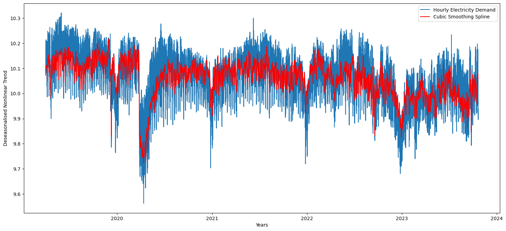
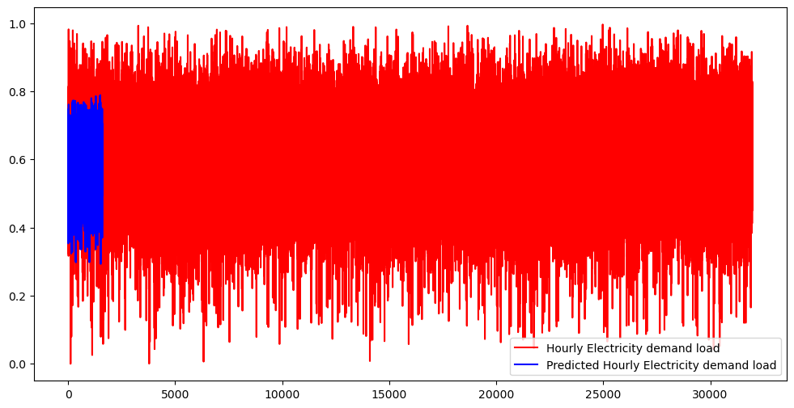
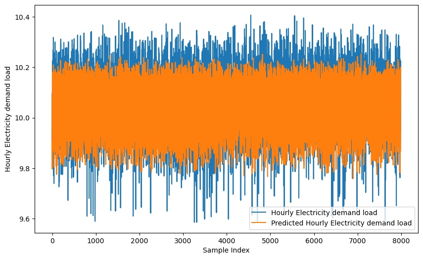

```python
import pandas as pd
import matplotlib.pyplot as plt
import numpy as np
from sklearn.cluster import KMeans
from sklearn.metrics import silhouette_score
from sklearn.preprocessing import MinMaxScaler
from tensorflow.keras.models import Sequential
import tensorflow as tf
from tensorflow.keras.layers import Conv1D, MaxPooling1D, Flatten, LSTM, Dense
from sklearn.ensemble import StackingRegressor
from sklearn.linear_model import Ridge
from tensorflow.keras.layers import Conv1D, MaxPooling1D, Flatten, Dense
from sklearn.model_selection import train_test_split
from sklearn.metrics import mean_absolute_error, mean_squared_error
from sklearn.ensemble import StackingRegressor
from sklearn.linear_model import LinearRegression
from statsmodels.tsa.seasonal import seasonal_decompose
from matplotlib import pyplot
import pymannkendall as mk
import seaborn as sns
import statsmodels.api as sm
import scipy.stats as stats
from scipy.stats import kurtosis, skew
import scipy
from scipy.interpolate import UnivariateSpline
import matplotlib.dates as mdates
import keras.backend as K
from scipy.interpolate import LSQUnivariateSpline
from sklearn.metrics import mean_squared_error, mean_absolute_error
from pygam import LinearGAM
from keras.optimizers import Adam
######  Load data #####3
Katleho = pd.read_csv('Eskom.csv')
Katleho['Date'] = pd.to_datetime(Katleho['Date'], infer_datetime_format=True)
Hlompho= Katleho.set_index(['Date'])
print(Hlompho)
```

                         Electricity
    Date                            
    2019-04-01 00:00:00    21035.270
    2019-04-01 01:00:00    20548.270
    2019-04-01 02:00:00    20413.270
    2019-04-01 03:00:00    20476.400
    2019-04-01 04:00:00    21156.270
    ...                          ...
    2023-10-21 19:00:00    23665.984
    2023-10-21 20:00:00    22559.798
    2023-10-21 21:00:00    20760.183
    2023-10-21 22:00:00    19574.184
    2023-10-21 23:00:00    18592.524
    
    [39960 rows x 1 columns]
    


```python
###### Log-transformation of the dataset 
Hlompho['Electricity.log'] = np.log1p(Hlompho['Electricity'])
print(Hlompho)
```

                         Electricity  Electricity.log
    Date                                             
    2019-04-01 00:00:00    21035.270         9.954003
    2019-04-01 01:00:00    20548.270         9.930581
    2019-04-01 02:00:00    20413.270         9.923989
    2019-04-01 03:00:00    20476.400         9.927077
    2019-04-01 04:00:00    21156.270         9.959739
    ...                          ...              ...
    2023-10-21 19:00:00    23665.984        10.071836
    2023-10-21 20:00:00    22559.798        10.023969
    2023-10-21 21:00:00    20760.183         9.940840
    2023-10-21 22:00:00    19574.184         9.882018
    2023-10-21 23:00:00    18592.524         9.830569
    
    [39960 rows x 2 columns]
    


```python
#########   Classical Decomposition using multiplicative method  #####
result = seasonal_decompose(Hlompho["Electricity.log"], model='multiplicative',extrapolate_trend='freq')
result.plot()
pyplot.show()
```


    

    


```python
# Extract the components
Trend = result.trend
Seasonal = result.seasonal
Cyclical = result.resid
# Extract deseasonalized time series
deseasonalized_series = Hlompho['Electricity.log']/Seasonal
print(deseasonalized_series)
```

    Date
    2019-04-01 00:00:00    10.094284
    2019-04-01 01:00:00    10.090019
    2019-04-01 02:00:00    10.089699
    2019-04-01 03:00:00    10.084455
    2019-04-01 04:00:00    10.071962
                             ...    
    2023-10-21 19:00:00     9.939591
    2023-10-21 20:00:00     9.938568
    2023-10-21 21:00:00     9.928235
    2023-10-21 22:00:00     9.932827
    2023-10-21 23:00:00     9.937368
    Length: 39960, dtype: float64
    


```python
# Create hierarchical features
Hlompho['Hour'] = deseasonalized_series.index.hour
Hlompho['Day'] = deseasonalized_series.index.day
Hlompho['Week'] = deseasonalized_series.index.isocalendar().week
Hlompho['Month'] = deseasonalized_series.index.month
Hlompho['Quarter'] = deseasonalized_series.index.quarter
Hlompho['Half_Year'] = (deseasonalized_series.index.month <= 6).astype(int) + 1
Hlompho['Year'] = deseasonalized_series.index.year
# Display the DataFrame with the new features
print(Hlompho.head())
```

                         Electricity  Electricity.log  Hour  Day  Week  Month  \
    Date                                                                        
    2019-04-01 00:00:00     21035.27         9.954003     0    1    14      4   
    2019-04-01 01:00:00     20548.27         9.930581     1    1    14      4   
    2019-04-01 02:00:00     20413.27         9.923989     2    1    14      4   
    2019-04-01 03:00:00     20476.40         9.927077     3    1    14      4   
    2019-04-01 04:00:00     21156.27         9.959739     4    1    14      4   
    
                         Quarter  Half_Year  Year  
    Date                                           
    2019-04-01 00:00:00        2          2  2019  
    2019-04-01 01:00:00        2          2  2019  
    2019-04-01 02:00:00        2          2  2019  
    2019-04-01 03:00:00        2          2  2019  
    2019-04-01 04:00:00        2          2  2019  
    


```python
####   Extracting nonlinear trend using Cubic spline function
date_index = Hlompho.index
observed_values = deseasonalized_series 
# Extract the time index and the observed values
date_index = Hlompho.index
observed_values = deseasonalized_series 

# Convert date_index to numeric format
numeric_date_index = mdates.date2num(date_index)

# Fit a cubic smoothing spline
spline = UnivariateSpline(numeric_date_index, observed_values, k=3, s=0.001)

# Evaluate the spline on a finer grid for smoother visualization
date_index_fine = pd.date_range(start=date_index.min(), end=date_index.max(), freq='D')
numeric_date_index_fine = mdates.date2num(date_index_fine)
spline_values = spline(numeric_date_index_fine)
print(spline_values)
```

    [10.09431329 10.10614474 10.10384283 ... 10.03972488 10.07783893
     10.05964435]
    


```python
# Create a new UnivariateSpline object with the coefficients from the previous fit
fitted_spline = UnivariateSpline(numeric_date_index_fine, spline_values, k=3, s=0)

# Now, you can use the fitted_spline object to evaluate the trend at specific points or plot it
# For example:
new_points = [numeric_date_index_fine[0], numeric_date_index_fine[-4]]
fitted_values = fitted_spline(new_points)

print("Fitted spline values at the new points:", fitted_values)

```

    Fitted spline values at the new points: [24294.1890828  23082.16468705]
    


```python
# Plot the original data and the fitted spline
plt.figure(figsize=(18, 8))
plt.plot(date_index, observed_values, label='Hourly Electricity Demand')
plt.plot(date_index_fine, spline_values, label='Cubic Smoothing Spline', color='red')
plt.title('')
plt.xlabel('Years')
plt.ylabel('Deseasonalised Nonlinear Trend')
plt.legend()
plt.show()
```


    

    


```python
Hlompho = Hlompho.dropna()
target_feature = "Electricity.log"
# Select the hierarchical features and target feature
features = ['Hour', 'Day', 'Week', 'Month', 'Quarter', 'Half_Year', 'Year', target_feature]
# Normalize the data
scaler = MinMaxScaler()
scaled_data = scaler.fit_transform(Hlompho[features])
```


```python
##### Extract features and target
X1 = Hlompho[features[:-1]].values  # Exclude the target feature
y1 = Hlompho[features[-1]].values  # Target feature
# Normalize the data
scaler_X1 = MinMaxScaler()
scaler_y1 = MinMaxScaler()

X_scaled1 = scaler_X1.fit_transform(X1)
y_scaled1 = scaler_y1.fit_transform(y1.reshape(-1, 1)).flatten()
# Reshape the input for Conv1D
X_scaled1 = X_scaled1.reshape((X_scaled1.shape[0], X_scaled1.shape[1], 1))

# Split the data into training and validation sets
X_Train, X_Val, y_Train, y_Val = train_test_split(X_scaled1, y_scaled1, test_size=0.2, random_state=42)
X_Val, X_Test, y_Val, y_Test = train_test_split(X_Val, y_Val, test_size=0.2, random_state=42)
# Print the shapes of the datasets
print(f"Training set: {X_Train.shape}")
print(f"Validation set: {X_Val.shape}")
print(f"Testing set: {X_Test.shape}")
```

    Training set: (31968, 7, 1)
    Validation set: (6393, 7, 1)
    Testing set: (1599, 7, 1)
    


```python
# Define SMAPE custom metric
def smape_metric(y_true, y_pred):
    numerator = K.abs(y_true - y_pred)
    denominator = K.abs(y_true) + K.abs(y_pred)
    return 200 * K.mean(K.clip(numerator / denominator, 0.0, 1.0), axis=-1)

# Define MFE custom metric
def mfe_metric(y_true, y_pred):
    return K.mean(y_true - y_pred, axis=-1)
```


```python
# Build the RNN model
model = Sequential()
model.add(LSTM(units=200, activation='relu', input_shape=(X_Train.shape[1], X_Train.shape[2])))
model.add(Dense(units=1))
# Train the model with custom metrics
model.compile(optimizer='adam', loss='mean_squared_error', metrics=['mae', smape_metric, mfe_metric])
# Train the model with testing data
history = model.fit(X_Test, y_Test, epochs=10, batch_size=32, validation_data=(X_Val, y_Val))
```

    Epoch 1/10
    50/50 [==============================] - 5s 46ms/step - loss: 0.0772 - mae: 0.2154 - smape_metric: 47.1101 - mfe_metric: 0.1073 - val_loss: 0.0262 - val_mae: 0.1316 - val_smape_metric: 22.4401 - val_mfe_metric: -0.0147
    Epoch 2/10
    50/50 [==============================] - 2s 30ms/step - loss: 0.0247 - mae: 0.1283 - smape_metric: 22.2848 - mfe_metric: 0.0065 - val_loss: 0.0238 - val_mae: 0.1261 - val_smape_metric: 21.7524 - val_mfe_metric: 0.0143
    Epoch 3/10
    50/50 [==============================] - 2s 31ms/step - loss: 0.0227 - mae: 0.1226 - smape_metric: 21.3619 - mfe_metric: 0.0031 - val_loss: 0.0224 - val_mae: 0.1221 - val_smape_metric: 21.0187 - val_mfe_metric: -0.0187
    Epoch 4/10
    16/50 [========>.....................] - ETA: 0s - loss: 0.0224 - mae: 0.1241 - smape_metric: 21.3296 - mfe_metric: -4.2331e-05


    ---------------------------------------------------------------------------

    KeyboardInterrupt                         Traceback (most recent call last)

    Cell In[50], line 8
          6 model.compile(optimizer='adam', loss='mean_squared_error', metrics=['mae', smape_metric, mfe_metric])
          7 # Train the model with testing data
    ----> 8 history = model.fit(X_Test, y_Test, epochs=10, batch_size=32, validation_data=(X_Val, y_Val))
    

    File ~\.conda\envs\Makatjane\lib\site-packages\keras\utils\traceback_utils.py:65, in filter_traceback.<locals>.error_handler(*args, **kwargs)
         63 filtered_tb = None
         64 try:
    ---> 65     return fn(*args, **kwargs)
         66 except Exception as e:
         67     filtered_tb = _process_traceback_frames(e.__traceback__)
    

    File ~\.conda\envs\Makatjane\lib\site-packages\keras\engine\training.py:1564, in Model.fit(self, x, y, batch_size, epochs, verbose, callbacks, validation_split, validation_data, shuffle, class_weight, sample_weight, initial_epoch, steps_per_epoch, validation_steps, validation_batch_size, validation_freq, max_queue_size, workers, use_multiprocessing)
       1556 with tf.profiler.experimental.Trace(
       1557     "train",
       1558     epoch_num=epoch,
       (...)
       1561     _r=1,
       1562 ):
       1563     callbacks.on_train_batch_begin(step)
    -> 1564     tmp_logs = self.train_function(iterator)
       1565     if data_handler.should_sync:
       1566         context.async_wait()
    

    File ~\.conda\envs\Makatjane\lib\site-packages\tensorflow\python\util\traceback_utils.py:150, in filter_traceback.<locals>.error_handler(*args, **kwargs)
        148 filtered_tb = None
        149 try:
    --> 150   return fn(*args, **kwargs)
        151 except Exception as e:
        152   filtered_tb = _process_traceback_frames(e.__traceback__)
    

    File ~\.conda\envs\Makatjane\lib\site-packages\tensorflow\python\eager\def_function.py:915, in Function.__call__(self, *args, **kwds)
        912 compiler = "xla" if self._jit_compile else "nonXla"
        914 with OptionalXlaContext(self._jit_compile):
    --> 915   result = self._call(*args, **kwds)
        917 new_tracing_count = self.experimental_get_tracing_count()
        918 without_tracing = (tracing_count == new_tracing_count)
    

    File ~\.conda\envs\Makatjane\lib\site-packages\tensorflow\python\eager\def_function.py:947, in Function._call(self, *args, **kwds)
        944   self._lock.release()
        945   # In this case we have created variables on the first call, so we run the
        946   # defunned version which is guaranteed to never create variables.
    --> 947   return self._stateless_fn(*args, **kwds)  # pylint: disable=not-callable
        948 elif self._stateful_fn is not None:
        949   # Release the lock early so that multiple threads can perform the call
        950   # in parallel.
        951   self._lock.release()
    

    File ~\.conda\envs\Makatjane\lib\site-packages\tensorflow\python\eager\function.py:2496, in Function.__call__(self, *args, **kwargs)
       2493 with self._lock:
       2494   (graph_function,
       2495    filtered_flat_args) = self._maybe_define_function(args, kwargs)
    -> 2496 return graph_function._call_flat(
       2497     filtered_flat_args, captured_inputs=graph_function.captured_inputs)
    

    File ~\.conda\envs\Makatjane\lib\site-packages\tensorflow\python\eager\function.py:1862, in ConcreteFunction._call_flat(self, args, captured_inputs, cancellation_manager)
       1858 possible_gradient_type = gradients_util.PossibleTapeGradientTypes(args)
       1859 if (possible_gradient_type == gradients_util.POSSIBLE_GRADIENT_TYPES_NONE
       1860     and executing_eagerly):
       1861   # No tape is watching; skip to running the function.
    -> 1862   return self._build_call_outputs(self._inference_function.call(
       1863       ctx, args, cancellation_manager=cancellation_manager))
       1864 forward_backward = self._select_forward_and_backward_functions(
       1865     args,
       1866     possible_gradient_type,
       1867     executing_eagerly)
       1868 forward_function, args_with_tangents = forward_backward.forward()
    

    File ~\.conda\envs\Makatjane\lib\site-packages\tensorflow\python\eager\function.py:499, in _EagerDefinedFunction.call(self, ctx, args, cancellation_manager)
        497 with _InterpolateFunctionError(self):
        498   if cancellation_manager is None:
    --> 499     outputs = execute.execute(
        500         str(self.signature.name),
        501         num_outputs=self._num_outputs,
        502         inputs=args,
        503         attrs=attrs,
        504         ctx=ctx)
        505   else:
        506     outputs = execute.execute_with_cancellation(
        507         str(self.signature.name),
        508         num_outputs=self._num_outputs,
       (...)
        511         ctx=ctx,
        512         cancellation_manager=cancellation_manager)
    

    File ~\.conda\envs\Makatjane\lib\site-packages\tensorflow\python\eager\execute.py:54, in quick_execute(op_name, num_outputs, inputs, attrs, ctx, name)
         52 try:
         53   ctx.ensure_initialized()
    ---> 54   tensors = pywrap_tfe.TFE_Py_Execute(ctx._handle, device_name, op_name,
         55                                       inputs, attrs, num_outputs)
         56 except core._NotOkStatusException as e:
         57   if name is not None:
    

    KeyboardInterrupt: 


```python
from keras.models import Sequential
from keras.layers import LSTM, Dense

# Build the RNN model with increased dense units
model = Sequential()

model.add(LSTM(units=200, activation='relu', return_sequences=True, input_shape=(X_Train.shape[1], X_Train.shape[2])))
model.add(LSTM(units=100, activation='relu', return_sequences=True))
model.add(LSTM(units=50, activation='relu'))
# Increase the number of units in the dense layer
model.add(Dense(units=256, activation='relu'))
model.add(Dense(units=1))
custom_optimizer = Adam(learning_rate=0.001)
model.compile(optimizer=custom_optimizer, loss='mean_squared_error', metrics=['mae', smape_metric, mfe_metric])

history = model.fit(X_Train, y_Train, epochs=10, batch_size=32, validation_data=(X_Val, y_Val))

```

    Epoch 1/10
    999/999 [==============================] - 29s 25ms/step - loss: 0.0204 - mae: 0.1092 - smape_metric: 19.6911 - mfe_metric: 0.0070 - val_loss: 0.0133 - val_mae: 0.0893 - val_smape_metric: 15.5487 - val_mfe_metric: -0.0215
    Epoch 2/10
    999/999 [==============================] - 24s 24ms/step - loss: 0.0120 - mae: 0.0849 - smape_metric: 14.9356 - mfe_metric: 1.3930e-04 - val_loss: 0.0095 - val_mae: 0.0746 - val_smape_metric: 13.1928 - val_mfe_metric: -0.0034
    Epoch 3/10
    999/999 [==============================] - 25s 25ms/step - loss: 0.0090 - mae: 0.0726 - smape_metric: 12.9141 - mfe_metric: 2.0124e-04 - val_loss: 0.0075 - val_mae: 0.0649 - val_smape_metric: 11.6453 - val_mfe_metric: -0.0051
    Epoch 4/10
    999/999 [==============================] - 25s 25ms/step - loss: 0.0082 - mae: 0.0686 - smape_metric: 12.2956 - mfe_metric: 1.8608e-04 - val_loss: 0.0094 - val_mae: 0.0777 - val_smape_metric: 13.7967 - val_mfe_metric: 0.0428
    Epoch 5/10
    999/999 [==============================] - 25s 25ms/step - loss: 0.0077 - mae: 0.0664 - smape_metric: 11.9393 - mfe_metric: 1.0457e-04 - val_loss: 0.0081 - val_mae: 0.0713 - val_smape_metric: 12.7800 - val_mfe_metric: 0.0325
    Epoch 6/10
    999/999 [==============================] - 25s 25ms/step - loss: 0.0073 - mae: 0.0648 - smape_metric: 11.6933 - mfe_metric: 6.2485e-05 - val_loss: 0.0069 - val_mae: 0.0607 - val_smape_metric: 10.9811 - val_mfe_metric: -0.0152
    Epoch 7/10
    999/999 [==============================] - 26s 26ms/step - loss: 0.0071 - mae: 0.0637 - smape_metric: 11.5013 - mfe_metric: 1.1943e-04 - val_loss: 0.0070 - val_mae: 0.0652 - val_smape_metric: 11.6364 - val_mfe_metric: 0.0212
    Epoch 8/10
    999/999 [==============================] - 25s 25ms/step - loss: 0.0067 - mae: 0.0621 - smape_metric: 11.2328 - mfe_metric: 1.7266e-05 - val_loss: 0.0060 - val_mae: 0.0577 - val_smape_metric: 10.4626 - val_mfe_metric: -0.0018
    Epoch 9/10
    999/999 [==============================] - 24s 24ms/step - loss: 0.0063 - mae: 0.0600 - smape_metric: 10.8853 - mfe_metric: -3.5684e-05 - val_loss: 0.0055 - val_mae: 0.0550 - val_smape_metric: 9.9930 - val_mfe_metric: -0.0113
    Epoch 10/10
    999/999 [==============================] - 24s 24ms/step - loss: 0.0056 - mae: 0.0571 - smape_metric: 10.3707 - mfe_metric: -4.2228e-05 - val_loss: 0.0051 - val_mae: 0.0540 - val_smape_metric: 9.7937 - val_mfe_metric: -0.0256
    


```python
# Evaluate the model on the training set
train_losses = model.evaluate(X_Train, y_Train)
mse_on_train= train_losses[0]  # Assuming MSE is the first metric
mae_on_train = train_losses[1]  # Assuming MAE is the second metric
smape_on_train = train_losses[2]  # Assuming SMAPE is the third metric
mfe_on_train = train_losses[3]  # Assuming MFE is the fourth metric

# Print the metrics on the training set
print(f'Mean Squared Error on Training Data: {mse_on_train}')
print(f'Mean Absolute Error on Training Data: {mae_on_train}')
print(f'Symmetric Mean Absolute Percentage Error on Training Data: {smape_on_train}')
print(f'Mean Forecast Error on Training Data: {mfe_on_train}')
```

    999/999 [==============================] - 12s 12ms/step - loss: 0.0054 - mae: 0.0554 - smape_metric: 10.0537 - mfe_metric: -0.0267
    Mean Squared Error on Training Data: 0.0053721158765256405
    Mean Absolute Error on Training Data: 0.05537546053528786
    Symmetric Mean Absolute Percentage Error on Training Data: 10.05370044708252
    Mean Forecast Error on Training Data: -0.026701856404542923
    


```python
# Make predictions
y_pred_rnn = model.predict(X_Test)
# Plot the results
plt.figure(figsize=(12, 6))
plt.plot(y_Train, label='Hourly Electricity demand load', color ='red')
plt.plot(y_pred_rnn, label='Predicted Hourly Electricity demand load', color ='blue')
plt.legend()
plt.show()
```

    50/50 [==============================] - 1s 6ms/step
    


    

    


```python
#Preparing data and Convert training set to float32 for fitting CNNN. 
X_train, X_test, y_train, y_test = train_test_split(X1, y1, test_size=0.2, random_state=42)
# Convert X_train and y_train to float32
X_train = X_train.astype(np.float32)
y_train = y_train.astype(np.float32)
X_val = X_Val.astype(np.float32)
y_val =y_Val.astype(np.float32)
X_test = X_test.astype(np.float32)
y_test = y_test.astype(np.float32)
```


```python
# Build the CNN model
model0 = Sequential()
model0.add(Conv1D(filters=64, kernel_size=3, activation='relu', input_shape=(X_test.shape[1], 1)))
model0.add(Flatten())
model0.add(Dense(64, activation='relu'))
model0.add(Dense(1, activation='linear'))
model0.compile(optimizer='adam', loss='mean_squared_error', metrics=['mae', smape_metric, mfe_metric])
```


```python
history = model0.fit(X_test, y_test, epochs=10, batch_size=32, validation_split=0.2)
```

    Epoch 1/10
    200/200 [==============================] - 3s 10ms/step - loss: 8.6875 - mae: 1.1821 - smape_metric: 12.1669 - mfe_metric: -0.0016 - val_loss: 0.0177 - val_mae: 0.1047 - val_smape_metric: 1.0415 - val_mfe_metric: -0.0171
    Epoch 2/10
    200/200 [==============================] - 1s 5ms/step - loss: 0.0188 - mae: 0.1099 - smape_metric: 1.0934 - mfe_metric: -6.0206e-05 - val_loss: 0.0141 - val_mae: 0.0939 - val_smape_metric: 0.9343 - val_mfe_metric: -0.0025
    Epoch 3/10
    200/200 [==============================] - 1s 5ms/step - loss: 0.0193 - mae: 0.1111 - smape_metric: 1.1050 - mfe_metric: 5.5656e-04 - val_loss: 0.0461 - val_mae: 0.1841 - val_smape_metric: 1.8193 - val_mfe_metric: -0.1803
    Epoch 4/10
    200/200 [==============================] - 1s 5ms/step - loss: 0.0235 - mae: 0.1221 - smape_metric: 1.2148 - mfe_metric: 4.9547e-06 - val_loss: 0.0340 - val_mae: 0.1526 - val_smape_metric: 1.5115 - val_mfe_metric: -0.1430
    Epoch 5/10
    200/200 [==============================] - 1s 5ms/step - loss: 0.0254 - mae: 0.1277 - smape_metric: 1.2704 - mfe_metric: 1.0847e-04 - val_loss: 0.0136 - val_mae: 0.0914 - val_smape_metric: 0.9093 - val_mfe_metric: -0.0229
    Epoch 6/10
    200/200 [==============================] - 1s 5ms/step - loss: 0.0381 - mae: 0.1570 - smape_metric: 1.5610 - mfe_metric: 2.2835e-05 - val_loss: 0.0555 - val_mae: 0.2067 - val_smape_metric: 2.0400 - val_mfe_metric: -0.2045
    Epoch 7/10
    200/200 [==============================] - 1s 5ms/step - loss: 0.0540 - mae: 0.1917 - smape_metric: 1.9063 - mfe_metric: -3.0795e-04 - val_loss: 0.0134 - val_mae: 0.0909 - val_smape_metric: 0.9036 - val_mfe_metric: -0.0284
    Epoch 8/10
    200/200 [==============================] - 1s 5ms/step - loss: 0.0831 - mae: 0.2365 - smape_metric: 2.3527 - mfe_metric: -2.0911e-05 - val_loss: 0.0209 - val_mae: 0.1142 - val_smape_metric: 1.1338 - val_mfe_metric: -0.0850
    Epoch 9/10
    200/200 [==============================] - 1s 5ms/step - loss: 0.1658 - mae: 0.3226 - smape_metric: 3.2116 - mfe_metric: 0.0011 - val_loss: 0.7301 - val_mae: 0.8460 - val_smape_metric: 8.0774 - val_mfe_metric: -0.8460
    Epoch 10/10
    200/200 [==============================] - 1s 5ms/step - loss: 0.3458 - mae: 0.4800 - smape_metric: 4.7790 - mfe_metric: -0.0022 - val_loss: 0.1615 - val_mae: 0.3842 - val_smape_metric: 3.8889 - val_mfe_metric: 0.3840
    


```python
# Evaluate the model on the training set
test_mse, test_mae, test_smape, test_mfe = model0.evaluate(X_test, y_test)
# Print the evaluation metrics for the training set
print(f'Training MSE: {test_mse}')
print(f'Training MAE: {test_mae}')
print(f'Training SMAPE: {test_smape}')
print(f'Training MFE: {test_mfe}')
```

    250/250 [==============================] - 1s 3ms/step - loss: 0.0074 - mae: 0.0691 - smape_metric: 0.6879 - mfe_metric: 4.4687e-04
    Training MSE: 0.0074410936795175076
    Training MAE: 0.06914921849966049
    Training SMAPE: 0.6879065632820129
    Training MFE: 0.0004468707484193146
    


```python
##### Making predictions   
y_pred_cnn = model0.predict(X_test)
```

    250/250 [==============================] - 1s 3ms/step
    


```python
# Assuming y_train and y_pred_cnn are 1D arrays or can be flattened
y_test_flattened = y_test.flatten()
y_pred_cnn_flattened = y_pred_cnn.flatten()

# Plotting
plt.figure(figsize=(10, 6))
plt.plot(y_test_flattened, label='Hourly Electricity demand load')
plt.plot(y_pred_cnn_flattened, label='Predicted Hourly Electricity demand load')
plt.title('')
plt.xlabel('Sample Index')
plt.ylabel('Hourly Electricity demand load')
plt.legend()
plt.show()
```


    

    


```python
# Build the LSTM model
model1 = Sequential()
model1.add(LSTM(units=200, activation='relu', input_shape=(X_Test.shape[1], X_Test.shape[2])))
model1.add(Dense(units=1, activation='linear'))
model1.compile(optimizer='adam', loss='mean_squared_error', metrics=['mae',smape_metric, mfe_metric])
# Train the model
model1.fit(X_Test, y_Test, epochs=10, batch_size=32, validation_data=(X_Val, y_Val))
```

    Epoch 1/10
    50/50 [==============================] - 5s 45ms/step - loss: 0.0772 - mae: 0.2132 - smape_metric: 46.6765 - mfe_metric: 0.1063 - val_loss: 0.0270 - val_mae: 0.1335 - val_smape_metric: 22.6898 - val_mfe_metric: -0.0223
    Epoch 2/10
    50/50 [==============================] - 2s 30ms/step - loss: 0.0248 - mae: 0.1280 - smape_metric: 22.2121 - mfe_metric: 0.0036 - val_loss: 0.0246 - val_mae: 0.1280 - val_smape_metric: 22.1458 - val_mfe_metric: 0.0280
    Epoch 3/10
    50/50 [==============================] - 1s 30ms/step - loss: 0.0232 - mae: 0.1244 - smape_metric: 21.6786 - mfe_metric: 0.0063 - val_loss: 0.0226 - val_mae: 0.1230 - val_smape_metric: 21.2508 - val_mfe_metric: 0.0148
    Epoch 4/10
    50/50 [==============================] - 1s 29ms/step - loss: 0.0217 - mae: 0.1205 - smape_metric: 21.0298 - mfe_metric: -2.1662e-04 - val_loss: 0.0211 - val_mae: 0.1191 - val_smape_metric: 20.5864 - val_mfe_metric: -0.0081
    Epoch 5/10
    50/50 [==============================] - 1s 30ms/step - loss: 0.0209 - mae: 0.1185 - smape_metric: 20.6959 - mfe_metric: 7.4822e-04 - val_loss: 0.0205 - val_mae: 0.1178 - val_smape_metric: 20.4081 - val_mfe_metric: 0.0222
    Epoch 6/10
    50/50 [==============================] - 2s 31ms/step - loss: 0.0199 - mae: 0.1160 - smape_metric: 20.2972 - mfe_metric: -6.3106e-04 - val_loss: 0.0193 - val_mae: 0.1143 - val_smape_metric: 19.8160 - val_mfe_metric: 0.0205
    Epoch 7/10
    50/50 [==============================] - 2s 31ms/step - loss: 0.0188 - mae: 0.1116 - smape_metric: 19.5226 - mfe_metric: 1.2362e-04 - val_loss: 0.0173 - val_mae: 0.1075 - val_smape_metric: 18.6316 - val_mfe_metric: 0.0145
    Epoch 8/10
    50/50 [==============================] - 2s 32ms/step - loss: 0.0172 - mae: 0.1054 - smape_metric: 18.4393 - mfe_metric: -7.8573e-05 - val_loss: 0.0161 - val_mae: 0.1027 - val_smape_metric: 17.7652 - val_mfe_metric: 0.0276
    Epoch 9/10
    50/50 [==============================] - 2s 32ms/step - loss: 0.0160 - mae: 0.1017 - smape_metric: 17.8119 - mfe_metric: 8.9323e-04 - val_loss: 0.0141 - val_mae: 0.0938 - val_smape_metric: 16.3260 - val_mfe_metric: -0.0114
    Epoch 10/10
    50/50 [==============================] - 2s 31ms/step - loss: 0.0147 - mae: 0.0960 - smape_metric: 16.8869 - mfe_metric: 7.5772e-04 - val_loss: 0.0141 - val_mae: 0.0915 - val_smape_metric: 15.9764 - val_mfe_metric: -0.0351
    


    <keras.callbacks.History at 0x23594260610>


```python
def symmetric_mean_absolute_percentage_error(y_true, y_pred):
    numerator = np.abs(y_pred - y_true)
    denominator = (np.abs(y_true) + np.abs(y_pred)) / 2
    smape = np.mean(numerator / denominator) *100
    return smape

def mfe(y_true, y_pred):
    mfe = np.mean(y_pred - y_true)
    return mfe
```


```python
# Make predictions on the validation set
y_pred_lstm = model1.predict(X_Val)

# Invert scaling to get predictions in the original scale
y_pred_inv = scaler_y1.inverse_transform(y_pred_lstm.reshape(-1, 1)).flatten()
y_val_inv = scaler_y1.inverse_transform(y_Val.reshape(-1, 1)).flatten()

# Calculate MAE, MAPE, MSE, and RMSE
mae = mean_absolute_error(y_val_inv, y_pred_inv)
smape = symmetric_mean_absolute_percentage_error(y_val_inv, y_pred_inv)
mfe = mfe(y_val_inv, y_pred_inv)
mse = mean_squared_error(y_val_inv, y_pred_inv)

print(f'Mean Squared Error (MSE): {mse}')
print(f'Mean Absolute Error (MAE): {mae}')
print(f'Symmetric Mean Absolute Percentage Error (SMAPE): {smape:.2f}%')
print(f'Mean Forecast Error (MFE): {mfe}')
```

    200/200 [==============================] - 1s 5ms/step
    Mean Squared Error (MSE): 0.01077588635642814
    Mean Absolute Error (MAE): 0.07996265686920287
    Symmetric Mean Absolute Percentage Error (SMAPE): 0.80%
    Mean Forecast Error (MFE): 0.030689099198620243
    


```python
####  Application of Stacking ensemble algorithm and Ensure all predictions have the same length
min_length = min(len(y_pred_rnn), len(y_pred_lstm), len(y_pred_cnn))
y_pred_rnn = y_pred_rnn[:min_length]
y_pred_lstm = y_pred_lstm[:min_length]
y_pred_cnn = y_pred_cnn[:min_length]
```


```python
# Stack the predictions horizontally
stacked_predictions = np.column_stack((y_pred_rnn, y_pred_cnn, y_pred_lstm))
# Train a meta-model (e.g., Linear Regression) on the stacked predictions
meta_model = LinearRegression()
meta_model.fit(stacked_predictions, y_val[:min_length])
```


<style>#sk-container-id-1 {color: black;background-color: white;}#sk-container-id-1 pre{padding: 0;}#sk-container-id-1 div.sk-toggleable {background-color: white;}#sk-container-id-1 label.sk-toggleable__label {cursor: pointer;display: block;width: 100%;margin-bottom: 0;padding: 0.3em;box-sizing: border-box;text-align: center;}#sk-container-id-1 label.sk-toggleable__label-arrow:before {content: "▸";float: left;margin-right: 0.25em;color: #696969;}#sk-container-id-1 label.sk-toggleable__label-arrow:hover:before {color: black;}#sk-container-id-1 div.sk-estimator:hover label.sk-toggleable__label-arrow:before {color: black;}#sk-container-id-1 div.sk-toggleable__content {max-height: 0;max-width: 0;overflow: hidden;text-align: left;background-color: #f0f8ff;}#sk-container-id-1 div.sk-toggleable__content pre {margin: 0.2em;color: black;border-radius: 0.25em;background-color: #f0f8ff;}#sk-container-id-1 input.sk-toggleable__control:checked~div.sk-toggleable__content {max-height: 200px;max-width: 100%;overflow: auto;}#sk-container-id-1 input.sk-toggleable__control:checked~label.sk-toggleable__label-arrow:before {content: "▾";}#sk-container-id-1 div.sk-estimator input.sk-toggleable__control:checked~label.sk-toggleable__label {background-color: #d4ebff;}#sk-container-id-1 div.sk-label input.sk-toggleable__control:checked~label.sk-toggleable__label {background-color: #d4ebff;}#sk-container-id-1 input.sk-hidden--visually {border: 0;clip: rect(1px 1px 1px 1px);clip: rect(1px, 1px, 1px, 1px);height: 1px;margin: -1px;overflow: hidden;padding: 0;position: absolute;width: 1px;}#sk-container-id-1 div.sk-estimator {font-family: monospace;background-color: #f0f8ff;border: 1px dotted black;border-radius: 0.25em;box-sizing: border-box;margin-bottom: 0.5em;}#sk-container-id-1 div.sk-estimator:hover {background-color: #d4ebff;}#sk-container-id-1 div.sk-parallel-item::after {content: "";width: 100%;border-bottom: 1px solid gray;flex-grow: 1;}#sk-container-id-1 div.sk-label:hover label.sk-toggleable__label {background-color: #d4ebff;}#sk-container-id-1 div.sk-serial::before {content: "";position: absolute;border-left: 1px solid gray;box-sizing: border-box;top: 0;bottom: 0;left: 50%;z-index: 0;}#sk-container-id-1 div.sk-serial {display: flex;flex-direction: column;align-items: center;background-color: white;padding-right: 0.2em;padding-left: 0.2em;position: relative;}#sk-container-id-1 div.sk-item {position: relative;z-index: 1;}#sk-container-id-1 div.sk-parallel {display: flex;align-items: stretch;justify-content: center;background-color: white;position: relative;}#sk-container-id-1 div.sk-item::before, #sk-container-id-1 div.sk-parallel-item::before {content: "";position: absolute;border-left: 1px solid gray;box-sizing: border-box;top: 0;bottom: 0;left: 50%;z-index: -1;}#sk-container-id-1 div.sk-parallel-item {display: flex;flex-direction: column;z-index: 1;position: relative;background-color: white;}#sk-container-id-1 div.sk-parallel-item:first-child::after {align-self: flex-end;width: 50%;}#sk-container-id-1 div.sk-parallel-item:last-child::after {align-self: flex-start;width: 50%;}#sk-container-id-1 div.sk-parallel-item:only-child::after {width: 0;}#sk-container-id-1 div.sk-dashed-wrapped {border: 1px dashed gray;margin: 0 0.4em 0.5em 0.4em;box-sizing: border-box;padding-bottom: 0.4em;background-color: white;}#sk-container-id-1 div.sk-label label {font-family: monospace;font-weight: bold;display: inline-block;line-height: 1.2em;}#sk-container-id-1 div.sk-label-container {text-align: center;}#sk-container-id-1 div.sk-container {/* jupyter's `normalize.less` sets `[hidden] { display: none; }` but bootstrap.min.css set `[hidden] { display: none !important; }` so we also need the `!important` here to be able to override the default hidden behavior on the sphinx rendered scikit-learn.org. See: https://github.com/scikit-learn/scikit-learn/issues/21755 */display: inline-block !important;position: relative;}#sk-container-id-1 div.sk-text-repr-fallback {display: none;}</style><div id="sk-container-id-1" class="sk-top-container"><div class="sk-text-repr-fallback"><pre>LinearRegression()</pre><b>In a Jupyter environment, please rerun this cell to show the HTML representation or trust the notebook. <br />On GitHub, the HTML representation is unable to render, please try loading this page with nbviewer.org.</b></div><div class="sk-container" hidden><div class="sk-item"><div class="sk-estimator sk-toggleable"><input class="sk-toggleable__control sk-hidden--visually" id="sk-estimator-id-1" type="checkbox" checked><label for="sk-estimator-id-1" class="sk-toggleable__label sk-toggleable__label-arrow">LinearRegression</label><div class="sk-toggleable__content"><pre>LinearRegression()</pre></div></div></div></div></div>


```python
# Extract coefficients of the fitted meta_model
meta_model_coefs = meta_model.coef_

# Print or use the coefficients as needed
print("Meta-model Coefficients:", meta_model_coefs)

```

    Meta-model Coefficients: [-2.4276778e-04  2.6921988e-02  1.0010206e+00]
    


```python
# Make predictions using the meta-model
stacked_pred_meta = meta_model.predict(stacked_predictions)
```


```python
def mfe_metric(y_true, y_pred):
    return np.mean(y_true - y_pred)
```


```python
# Assuming you have already defined smape_metric and mfe_metric functions
# Calculate evaluation metrics
mse_stacked = mean_squared_error(y_val[:min_length], stacked_pred_meta)
mae_stacked = mean_absolute_error(y_val[:min_length], stacked_pred_meta)
smape_stacked = smape_metric(y_val[:min_length], stacked_pred_meta)
mfe_stacked = mfe_metric(y_val[:min_length], stacked_pred_meta)
# Print or use the metrics as needed
print(f'Stacked Predictions Metrics:')
print(f'Mean Squared Error (MSE): {mse_stacked}')
print(f'Mean Absolute Error (MAE): {mae_stacked}')
print(f'Symmetric Mean Absolute Percentage Error (SMAPE): {smape_stacked:.2f}%')
print(f'Mean Forecast Error (MFE): {mfe_stacked}')

```

    Stacked Predictions Metrics:
    Mean Squared Error (MSE): 0.0057546463795006275
    Mean Absolute Error (MAE): 0.05743559077382088
    Symmetric Mean Absolute Percentage Error (SMAPE): 10.57%
    Mean Forecast Error (MFE): 1.5506898876083142e-07
    


```python
# Assuming y_pred_sarima, y_pred_rnn, y_pred_cnn, y_pred_lstm are already defined
# Stack the predictions horizontally
stacked_predictions = np.column_stack((y_pred_rnn, y_pred_lstm, y_pred_cnn))

# Assuming you have y_val for validation set
# Train a GAM model on the stacked predictions
gam_model = LinearGAM().fit(stacked_predictions, y_val[:min_length])

# Make predictions on the validation set
y_pred_gam = gam_model.predict(stacked_predictions)

# Calculate evaluation metrics
gam_mse = mean_squared_error(y_val[:min_length], y_pred_gam)
gam_mae = mean_absolute_error(y_val[:min_length], y_pred_gam)

# Define SMAPE and MFE functions
def symmetric_mean_absolute_percentage_error(y_true, y_pred):
    return 200 * np.mean(np.abs(y_pred - y_true) / (np.abs(y_pred) + np.abs(y_true)))

def mean_forecast_error(y_true, y_pred):
    return np.mean(y_pred - y_true)

# Calculate SMAPE and MFE
gam_smape = symmetric_mean_absolute_percentage_error(y_val[:min_length], y_pred_gam)
gam_mfe = mean_forecast_error(y_val[:min_length], y_pred_gam)

# Print the evaluation metrics
print(f'GAM MSE on Validation Set: {gam_mse}')
print(f'GAM MAE on Validation Set: {gam_mae}')
print(f'GAM SMAPE on Validation Set: {gam_smape}')
print(f'GAM MFE on Validation Set: {gam_mfe}')

```

    GAM MSE on Validation Set: 0.012532187910133689
    GAM MAE on Validation Set: 0.0875343615973852
    GAM SMAPE on Validation Set: 15.341140815139187
    GAM MFE on Validation Set: -4.274393777567982e-12
    


```python

```
